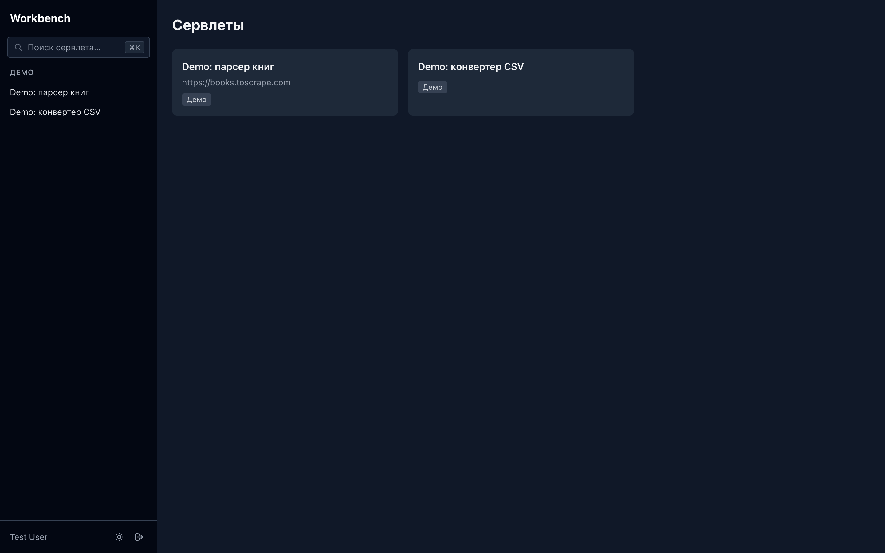
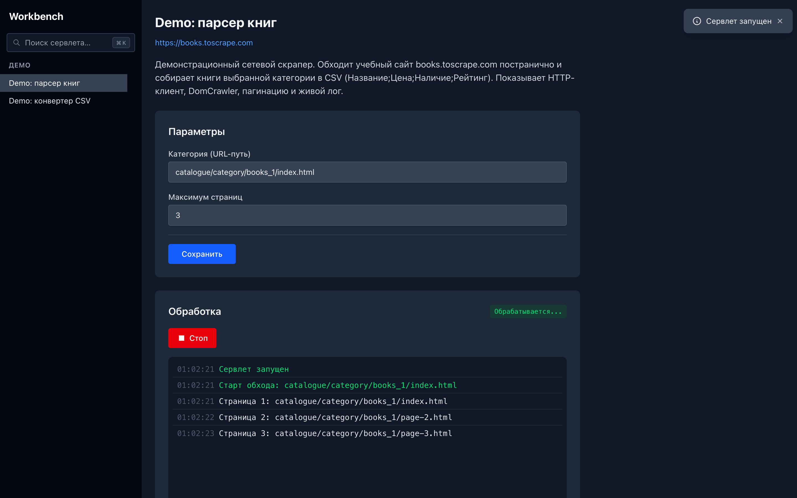
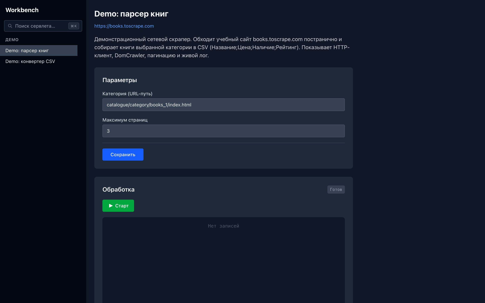
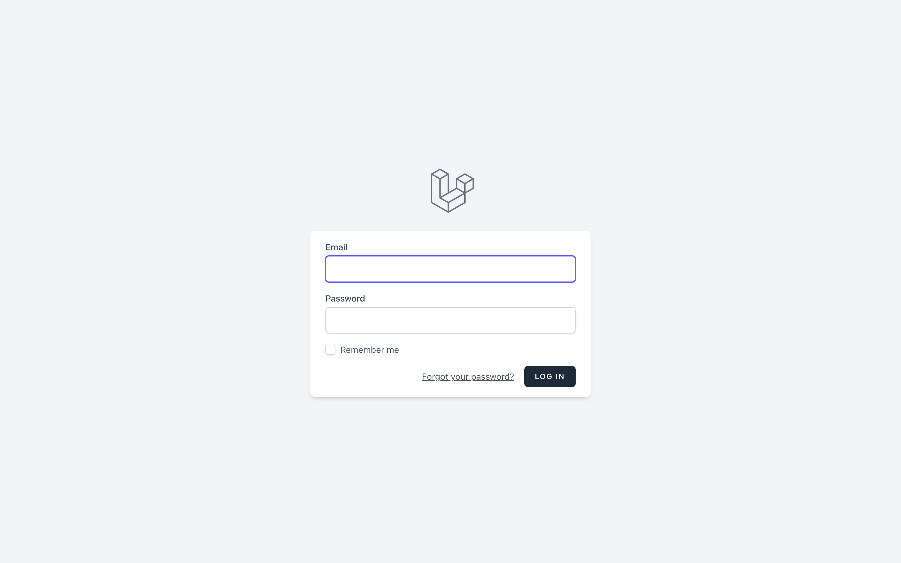

# Workbench

[🇬🇧 English](README.md) · **🇷🇺 Русский**


[](https://github.com/jazz-max/workbench/actions/workflows/ci.yml)

**Self-hosted дашборд для запуска и мониторинга фоновых задач на Laravel.**

Пишешь класс с методом `run()` — Workbench даёт ему веб-UI: запуск в один клик, форму параметров, **живой стрим логов по WebSocket** и работу с входными/выходными файлами. Скраперы, импортёры, конвертеры, генераторы отчётов — что угодно, что иначе гоняется из cron или CLI без интерфейса.

- 🧩 **Пишешь класс → получаешь UI.** Наследуешь `BaseServlet`, реализуешь `run()`, регистрируешь в JSON. Без контроллеров, Blade и отдельной админки под каждую задачу.
- 📡 **Живые логи по WebSocket.** Каждая задача стримит вывод в браузер в реальном времени (Laravel Reverb) — не нужно заходить по SSH и делать `tail`.
- 🗂 **Файлы и формы параметров из коробки.** Загрузка входных, скачивание результатов (по одному или ZIP), формы из JSON-описания.

> ⚠️ Если используешь Workbench для скрапинга — соблюдай условия использования сайтов и закон. Скрапь ответственно и только там, где это разрешено.

## Интерфейс

Список сервлетов — живой поиск (`⌘/Ctrl + K`), тёмная тема, сайдбар по категориям:



Страница сервлета — параметры, запуск в один клик и **живой стрим логов по WebSocket**:



<details>
<summary>Ещё скриншоты</summary>

<br>

Страница сервлета (готов к запуску):



Вход (Laravel Breeze):



</details>

## Применение

Workbench подходит под любой сценарий **«оператор жмёт кнопку → задача выполняется → смотрим логи → забираем результат»**:

- 🕷 **Скрапинг / мониторинг цен и фидов** — главный пример; в комплекте демо-скрапер.
- 📥 **Импорт данных** — CSV/XLSX/фид → в БД или файлы, с формой для источника и кредов.
- 🔁 **Конвертация файлов** — пакетная обработка загруженных файлов (демо-конвертер CSV в комплекте).
- 📊 **Генерация отчётов/выгрузок** — CSV и экспорты по требованию (демо-генератор отчёта в комплекте), без отдельной админки.
- 🧰 **Внутренние инструменты** — дай не-разработчику кнопку и форму, чтобы он сам запускал параметризованную задачу.
- ⏱ **Cron + CLI с интерфейсом** — оставь планировщик, но дай скриптам дашборд, живые логи и работу с файлами.

## Возможности

- 🧩 **Сервлеты** — единица работы: наследуешь `BaseServlet`, реализуешь `run()`. Три демо в комплекте (сетевой скрапер, файловый конвертер, генератор отчёта).
- 📡 **Живые логи** — `log()/notice()/warn()/error()/debug()` стримятся в браузер в реальном времени (Laravel Reverb / WebSocket).
- 🗂 **Файлы** — загрузка входных, скачивание результатов (по одному или ZIP), очистка `in`/`out` по каждому сервлету и пользователю.
- ⚙️ **Параметры** — формы (текст, пароль, чекбоксы) описываются в `resources/data/servlets.json`, значения сохраняются по пользователю.
- 🔐 **Авторизация** — Laravel Breeze (логин / регистрация / сброс пароля) на том же Inertia + Vue стеке.
- 🌓 **UI** — адаптивный сайдбар, тёмная тема, командная палитра (`⌘/Ctrl + K`), скрытие неактивных сервлетов.
- 🛠 **HTTP-клиент для скраперов** (`HasHttpClient`, опционально) — Laravel HTTP + cookie-jar, retry/backoff, Symfony DomCrawler, хелперы CSV и кодировок.

## Стек

- **Backend:** PHP 8.4, Laravel 13
- **Frontend:** Inertia.js + Vue 3 + Tailwind CSS 4 (Vite)
- **Realtime:** Laravel Reverb (WebSocket)
- **Auth:** Laravel Breeze (Inertia/Vue)

## Быстрый старт

### Локально (нужны PHP 8.4, Composer, Node 20+)

```bash
git clone https://github.com/jazz-max/workbench.git && cd workbench
cp .env.example .env

composer install
php artisan key:generate
touch database/database.sqlite
php artisan migrate --seed      # создаст демо-пользователя (см. ниже)

npm install
npm run build                   # или `npm run dev` для разработки

# в отдельных терминалах:
php artisan serve               # http://localhost:8000
php artisan reverb:start        # WebSocket-сервер для живых логов
```

Демо-пользователь из сидера: **`test@example.com` / `password`** (или зарегистрируй нового через `/register`).

### Docker

```bash
cp .env.example .env
./vendor/bin/sail up -d
./vendor/bin/sail artisan key:generate
./vendor/bin/sail artisan migrate --seed
./vendor/bin/sail npm install && ./vendor/bin/sail npm run build
```
Приложение: `http://localhost:8083` (порт настраивается через `APP_PORT`).

## Как написать сервлет

1. Создай класс в `app/Servlets/`, наследующий `App\Servlets\BaseServlet`, и реализуй `run(): bool`.
2. Зарегистрируй его в `resources/data/servlets.json` — **обязательно с FQN-именем класса** (с обратным слэшем), иначе он не появится в интерфейсе.

```php
<?php

namespace App\Servlets;

class GenerateReport extends BaseServlet
{
    public function run(): bool
    {
        $this->notice('Старт…');               // → живой лог в UI

        $rows = (int) ($this->params->rows ?? 100);
        $path = $this->params->outputPath . 'report.csv';

        $h = fopen($path, 'w');
        fputcsv($h, ['id', 'value']);
        for ($i = 1; $i <= $rows; $i++) {
            fputcsv($h, [$i, mt_rand(1, 1000)]);
        }
        fclose($h);

        $this->notice("Готово: записано строк — {$rows}");
        return true;
    }
}
```

```json
{
  "Мои задачи": {
    "generate-report": {
      "classname": "App\\Servlets\\GenerateReport",
      "title": "Генератор отчёта",
      "url": "",
      "description": "Что он делает",
      "params": [
        { "name": "rows", "label": "Строк", "type": "text", "value": "100" }
      ]
    }
  }
}
```

Для **сетевых** задач добавь `use App\Servlets\Concerns\HasHttpClient;` — получишь HTTP-клиент (cookie-jar, retry, DomCrawler), см. `app/Servlets/DemoBooksScraper.php`.

Готовые демо: `DemoBooksScraper.php` (сетевой скрапер), `DemoCsvConverter.php` (файловый конвертер), `DemoReportServlet.php` (генератор отчёта, работает из коробки).

### Полезное из `BaseServlet` / `HasHttpClient`

| Метод | Назначение |
|---|---|
| `log/notice/warn/error/debug($msg)` | запись в живой лог UI (и в `work.log`) |
| `$this->params->{inputPath,outputPath,coockiePath}` | пути файлов сервлета |
| `clearOutputDir()` / `clearin()` | очистка результатов / входных файлов |
| `loadLocalParams()/saveLocalParams()` | персистентное состояние (`local_params.json`) |
| `initHttp($base)` / `fetchCrawler($uri)` / `httpGet/httpPost` | HTTP + DomCrawler *(HasHttpClient)* |
| `writeCsv($dir,$name,$rows)` / `clean()` / `processPrice()` | обработка и запись *(HasHttpClient)* |

Для источников не в UTF-8 задай `protected ?string $sourceEncoding = 'windows-1251';`, для выходных файлов — `protected string $outputEncoding = 'windows-1251';` (по умолчанию всё UTF-8).

## Сравнение

**Для скрапинга** — почти все раннеры в этой нише на Python/Go; Workbench — вариант для тех, кто на PHP/Laravel:

| | Workbench | Scrapyd / Gerapy / Scrapydweb | Crawlab |
|---|---|---|---|
| Язык скрапера | **PHP** (Guzzle, Roach PHP, DomCrawler) | Python (Scrapy) | любой (CLI) |
| Стек | Laravel + Vue | Python | Go + MongoDB |
| Живые логи | **WebSocket, реалтайм** | опрос / файлы | да |
| Лишний рантайм для Laravel-команды | **нет** | Python | Go-кластер |

**Для запуска задач вообще** — Workbench для оператора, а не воркер очереди:

| | Workbench | Laravel Horizon | cron + скрипты |
|---|---|---|---|
| Триггер | **оператор жмёт «Старт»** (с формой) | автоматически, из очереди | по расписанию |
| Для чего | параметризованные задачи по требованию | фоновые задачи очереди | скрипты без присмотра |
| UI / живые логи / файлы | **да** | только метрики очереди | нет |

Horizon — для очередей; Workbench — когда задачу должен запустить человек, заполнить параметры, увидеть процесс и скачать результат.

## Живые логи (Reverb)

Стриминг логов работает через [Laravel Reverb](https://reverb.laravel.com). Заполни в `.env` ключи `REVERB_APP_*` и `VITE_REVERB_*`, запусти `php artisan reverb:start` и убедись, что `BROADCAST_CONNECTION=reverb`. Каналы публичные (изоляция по `userId` в имени канала), отдельная channel-авторизация не нужна.

## Удалённый доступ (MCP)

Компаньон-проект [**workbench-mcp**](https://github.com/jazz-max/workbench-mcp) — MCP-сервер, через который Claude CLI с другой машины может читать/писать файлы проекта, искать код, запускать allow-listed команды и git, а также делегировать кодинг Claude'у на хосте. Удобно для удалённой разработки сервлетов.

## Опциональная proxy-фича

В комплекте есть выключенный по умолчанию пример reverse-proxy к сайту-источнику (например, чтобы открыть корзину/чекаут источника прямо в UI). Чтобы включить: раскомментируй `ServletController::proxy()` и роут `servlet/*/proxy/*`, при необходимости — `validateCsrfTokens`/`trustProxies` в `bootstrap/app.php`, и задай `VITE_ENABLE_PROXY=true`. Скелет обобщённый — допиши под движок целевого сайта.

## Конфигурация

Все настройки — через `.env` (см. `.env.example`). По умолчанию БД — SQLite, очередь/кэш/сессии — в БД, рассылка логов — Reverb.

## Тесты

```bash
php artisan test       # тесты идут на in-memory SQLite
./vendor/bin/pint      # стиль кода (Laravel Pint)
```

## Лицензия

[MIT](LICENSE). PR и issue приветствуются — см. [CONTRIBUTING.md](CONTRIBUTING.md).
